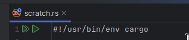

# RustRover Playground

Support for [cargo-script RFC](https://rust-lang.github.io/rfcs/3424-cargo-script.html) within RustRover scratch files!

Just create a new scratch file via `File > New > Scratch File > Rust` and follow the rust-script format defined in the RFC.

First of all, you will need to add the shebang line `#!/usr/bin/env cargo`. This will make a new "run" button pop.



Then, you *may* add dependencies by following the RFC.
You need to wrap them in three dashes `---` and then add the content you would put in a `Cargo.toml`.

Here is an example that was picked from the [RFC tracking issue](https://github.com/rust-lang/cargo/issues/12207#issuecomment-3412997290):

```rust
#!/usr/bin/env -S cargo +nightly -Zscript

---
[dependencies]
clap = { version = "4.2", features = ["derive"] }
---

use clap::Parser;

#[derive(Parser, Debug)]
struct Args
{
    /// Path to config
    #[arg(short, long)]
    config: Option<std::path::PathBuf>,
}

fn main() {
    let args = Args::parse();
    println!("{:?}", args);
}
```